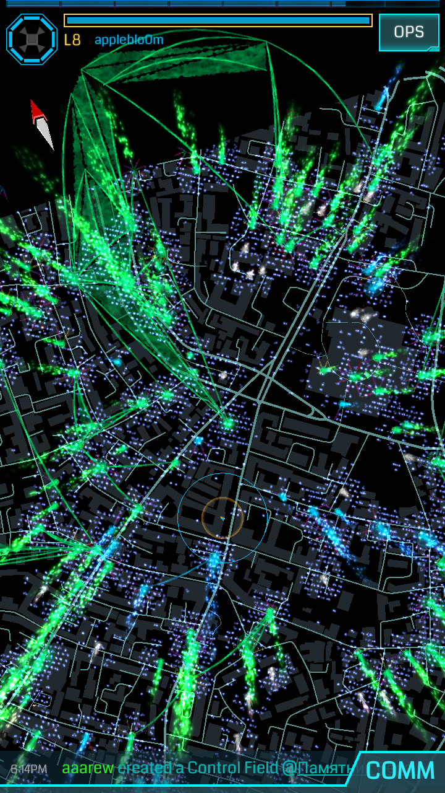
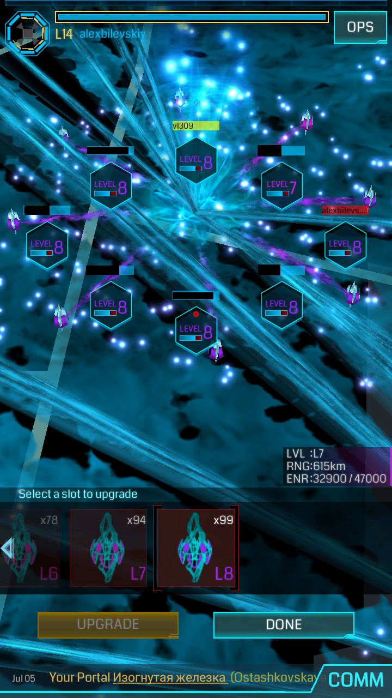
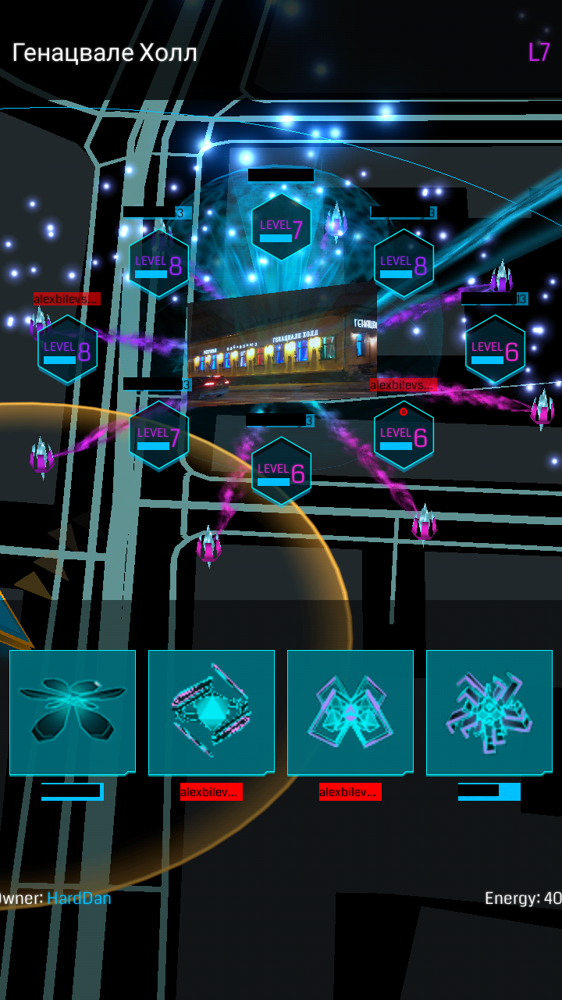

## Personal mod for Ingress Scanner [REDACTED]

Main features:
1. MAP: smaller zoom level
2. MAP: increase radius for loading nearby portals
3. MAP: allow view from the top (change camera perspective)
4. UI: highlight own resonators in deploy view, highlight own mods
5. UI: glyphs (no cheating!) show successful/unsuccessful glyph sequences in toast message after hack
6. log ALL network traffic to file
7. *almost* decrypted clientBlob and map tile format
8. misc - comm regexp filter, slightly lower max fire rate

### 1,2,3  

### 4

### 5

